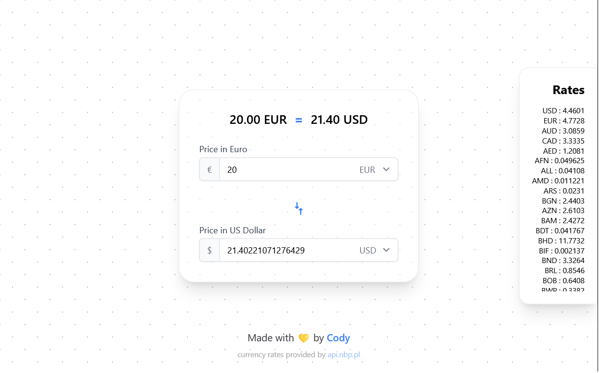

<h1 align="center">
🪙 Currency Converter
</h1>

<p align="center">
A simple currency converter with real-time rates created using <a href="https://nodejs.org/en/">Node.js</a>
</p>
<h3 align="center">
Try it <a href="https://currency.codyadm.com/">here</a>!
</h3>



## ✨ Tech Stack

- [Astro](https://astro.build/) for static site generation
- [TypeScript](https://www.typescriptlang.org/) for type safety
- [React](https://reactjs.org/) for UI
- [Tailwind CSS](https://tailwindcss.com/) for styling
- [React Query](https://react-query.tanstack.com/) for data fetching
- [Common Currencies](https://github.com/moonshot-partners/common-currencies/) for currency data
- [api.nbp.pl API](https://api.nbp.pl/) for currency rates
- [Jest](https://jestjs.io/) for testing 


## 🚀 Project Structure

Inside the project, you'll see the following folders and files:

``` 
📦currency-converter
 ┣ 📂doc
 ┣ 📂public                     Static assets
 ┣ 📂src
 ┃ ┣ 📂components               React components
 ┃ ┃ ┣ 📂icons
 ┃ ┃ ┣ 📜App                    Main React page
 ┃ ┃ ┣ 📜Converter.tsx
 ┃ ┃ ┣ 📜CurrencyInput.tsx
 ┃ ┃ ┗ 📜RatesDisplay.tsx        
 ┃ ┣ 📂pages
 ┃ ┃ ┗ 📜index.astro            Page entry point
 ┃ ┣ 📂utils
 ┃ ┃ ┗ 📜currencies.ts          Currency data
 ┃ ┗ 📜env.d.ts
 ┣ 📜package.json
 ┣ ...
 ┗ 📜README.md
```

## 🧞 Commands

All commands are run from the root of the project, from a terminal:

| Command           | Action                                       |
| :---------------- | :------------------------------------------- |
| `npm install`     | Installs dependencies                        |
| `npm run dev`     | Starts local dev server at `localhost:3000`  |
| `npm run build`   | Build your production site to `./dist/`      |
| `npm run preview` | Preview your build locally, before deploying |
| `npm run test`    | Run tests                                    |
